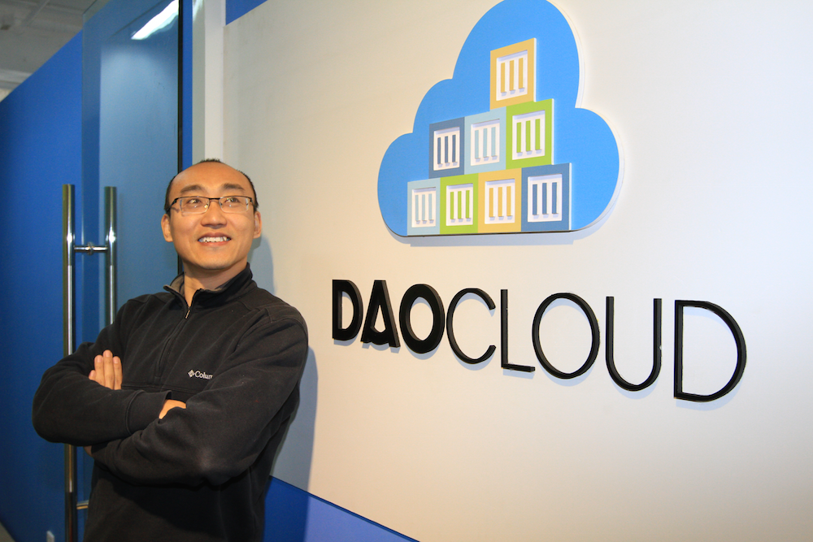

# 郭峰 #

郭峰 
DaoCloud

### 自我介绍
2007年毕业于同济大学获计算机科学硕士，同年夏天作为第一批员工加入EMC中国研发中心。目前为EMC中国研究院云平台的主任工程师，也是中国最早接触Cloud Foundry、OpenStack及Docker的技术人员，在开源社区拥有很高的声誉。郭峰本人专长于云平台及服务构建、分布式系统及虚拟化技术，是公认的该领域专家，并曾多次受邀参与在总部的核心项目开发工作。
 
郭峰拥有二十多项美国专利申请，多次获得年度创新大奖并接受高层嘉奖，他在EMC全球创新影响力排名中位列前十。此外他还拥有丰富的企业应用及数据平台化的经验，曾参与Spring框架项目开发，是一名业内顶尖的应用架构专家。

### 分享主题

 golang在持续交付中的实践

### 内容简介

​- 什么是持续交付
​​- 为什么要持续交付
​- golang在持续交付中面临的挑战
​- 我们的实践分享
​- 答疑